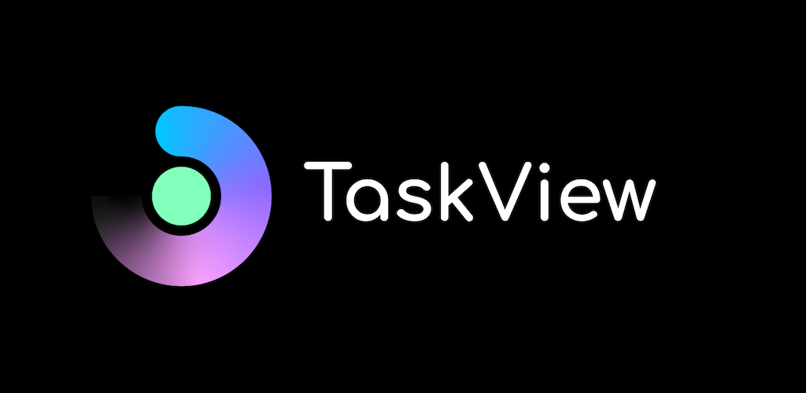

# TaskView™

  

TaskView is a self-hosted project and task management platform focused on clarity, ownership, and control.
TaskView is built for teams that want a transparent, self-hosted alternative to SaaS task managers.

It is designed for teams and individuals who want:  
- full control over their data
- transparent architecture
- predictable workflows
- the ability to run the system on their own infrastructure

## Key Features  
- Projects, lists, tasks, and subtasks
- Kanban boards
- Clear responsibility assignment
- Permissions and roles
- Web and mobile clients
- Self-hosted by design

## Licensing

TaskView uses a source-available license.

You may:  
- self-host TaskView
- modify the source code
- use it internally within your organization

You may not:  
- offer TaskView as a hosted SaaS
- sell TaskView as a service
- create a competing commercial product
- use the TaskView name or branding for derivative products

See LICENSE for full terms.
TaskView is a trademark of its authors.

## Architecture

This repository is a monorepo.

Main product packages:

 - `api` – backend (Node.js)
 - `web` – web client and mobile
 - `taskview-packages/taskview-api` – API client library for building integrations and making HTTP requests
 - `taskview-packages/taskview-db-schemas` - Drizzle ORM schemas

Product packages share a single version.


## Versioning

TaskView follows semantic versioning:
 - `MAJOR` – breaking API or data changes
 - `MINOR` – new features
 - `PATCH` – bug fixes
The version represents the entire product, not individual packages.


## Status

TaskView is under active development.  
Breaking changes may occur between versions.

## Getting started

This setup is intended for local development.

### Development

**Prerequisites:**
- Docker
- PostgreSQL
  - On macOS you can use https://postgresapp.com/
- Bun (used for API development)
- pnpm

**Steps:**
1. Install dependencies:
```sh
pnpm install
```

2. Create an `.env` file in the **api** directory based on `.env.example` and configure your local credentials.
   
3. Run the web application:
```sh
cd web
pnpm dev
```

1. Run the API locally (API uses Bun in development mode):
```sh
cd api
pnpm start
```

## Building Docker Images

You can build Docker images using the provided bash script. The image version is automatically taken from the root `package.json`.

**Steps:**
1. Build images:
```sh
./build-dockers.sh
```

2. Verify built images:
```sh
docker images
```
You should see the following images:

`gimanhead/taskview-ce-api-server`
`gimanhead/taskview-ce-webapp`
`gimanhead/taskview-ce-db-migration`

3. Test images locally using Docker Compose:
```sh
cd api/dev-containers-test
docker-compose up
```

Make sure the image versions match the version defined in the root package.json.

## Roadmap

- Plugin / extension system
- Migrate to NuxtUI or similar ui library
- Enterprise SSO and identity integrations
- Redesign
- Desktop version


Note for contributors: contributions are accepted under the CLA (see CONTRIBUTING.md). The Project is distributed under the TaskView Source-Available License.

---

TaskView is developed and maintained by Nikolai Giman.

Copyright © 2026 Nikolai Giman
